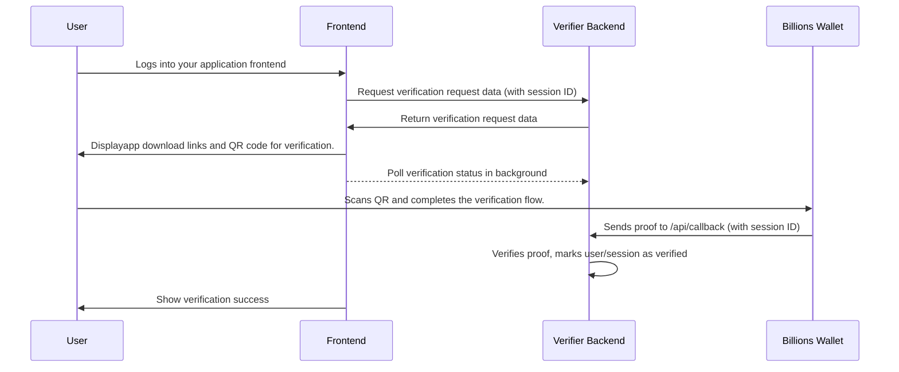

# Billions Integration Guide for Verifiers
---

## About this Example Repository

The [Billions Example Repo for verifications](https://github.com/0xPolygonID/Integration-examples/tree/main/POU-integration-for-verifiers) provides a working Express backend and static frontend for integrating Verification Flow via Billions Wallet. You can use this repo as a reference or starting point for your own integration.

---

## Overview of the Flow

1. **User visits your Application Frontend and logs in**
3. **User sees a "Verify with Billions" CTA section**
4. **User downloads the Billions mobile app** (if they haven't already).
5. **User scans the QR code** generated by your backend (see `/api/verification-request` endpoint in this repo).
6. **Check the verification status** on the front end by repeatedly calling `/api/status/{requestId}` with polling until you get a "success" or "failed" result.
7. **User completes the verification flow** in the Billions mobile app.
8. **Billions wallet sends a proof to your backend's `/api/callback` endpoint.**
9. **Your backend verifies the proof** and marks the user's session as verified.
10. **You can now track which users are verified** and use this for various use cases (registeration for airdrop, access control, allowlists, premium features, compliance, etc.).

---

## How to Use This Repo as a Starting Point

- Clone the [Billions Verifier Example Repo](https://github.com/0xPolygonID/Integration-examples/tree/main/POU-integration-for-verifiers).
- Follow the setup instructions in the README to install dependencies and configure your `.env` file.
- Use the provided backend (`js/index.js`) and static frontend (`static/index.html`, `static/index.js`) as a template for your own project.
- The `/api/verification-request` endpoint is used to generate a verification request that creates a QR code for the Billions mobile app. The static example shows how to 
fetch this request and present it as a QR to be scanned by end user.

---

## Integration Steps

### 1. **User Login and Session Management**

- When a user logs in to your platform/registration page (assuming you already have session management in place, such as session cookies, JWTs, etc.), ensure that a session is created for them.
- Assign a unique session ID to each login session. This session ID will be used to associate the Billions verification with the user's wallet.

> **Note:**
> The login process should either be performed via the user's wallet address (e.g., using MetaMask, WalletConnect, etc.), or you should explicitly collect the user's wallet address during registration. This wallet address is essential for populating the verification mapping and linking Billions verification to the user's identity for downstream use cases such as airdrops or allowlists. 


> **Best Practice:**
> When calling `/api/verification-request`, always pass the session ID that was created during the user's login process. This ensures that the Billions verification is linked to the correct user session or wallet in your system.

### 2. Supported Credential Verification Types

The Billions integration supports verification of 2 credentials currently:

- **POH (Proof of Humanity)**: Verify that the user is a real human via Human Credential
- **POU (Proof of Uniqueness)**: Verify that the user is unique (anti-Sybil) via Verified Human credential

For testing through the repo, set the appropriate `USE_CASE` environment variable, the configuration for both the verification types are already set in the `config/verification-configs.js` file for ease of integration. You can copy paste and use the same config in your setup.

### 3. **Generate the Verification Request and QR Code**

- When the user is logged in and ready to verify, call your backend's `/api/verification-request` endpoint (see this repo for implementation).
- **Pass the session ID (or a user identifier) to your backend** so it can associate the Billions session with the user's login session.
    - You can do this by including the session ID as a query parameter or in the request body.
    - **Example (query parameter):**
      ```js
      fetch(`/api/verification-request?sessionId=${yourLoginSessionId}`)
      ```
    - **Example (request body, if using POST):**
      ```js
      fetch('/api/verification-request', {
        method: 'POST',
        headers: { 'Content-Type': 'application/json' },
        body: JSON.stringify({ sessionId: yourLoginSessionId })
      })
      ```
- The backend should use this session ID (instead of generating a new one) when creating the universal link and storing the request. In the example repo we are creating a new one.


Calling the `/api/verification-request` endpoint returns a verification query (following the [ZK Query Language](https://docs.privado.id/docs/verifier/verification-library/zk-query-language)), which contains all the information the Billions wallet needs to generate a proof. This query includes:

- The callback URL to your backend, so the wallet knows where to send the proof after the user completes verification.
- The query parameters (e.g., credential type, allowed issuers, context, etc.) that define what the user must prove.

    > Display the data(verification query) received through the above endpoint as **QR code** on your frontend for the user to scan with the Billions mobile app.


**Important:**
- You should set the `NULLIFIER_SESSION_ID` and the `VERIFIER_DID` (your verifier DID) in the .env file.
- The `nullifierSessionID` parameter is used to ensure uniqueness and prevent replay attacks. 

> **POU Nullifier Note:**
> Store the `nullifierSessionID` and `verifierDID` in permanent storage or as a constant. If you lose them, you will lose all your verifications.


### 3. **User Downloads App and Scans QR Code**

- The user downloads the Billions mobile app from the App Store or Google Play if they haven't previously.
- They scan the QR code displayed on your website using the Billions app
- They complete the verification flow (claim credential, click verify).
- The Billions wallet sends the zk proof to your backend's `/api/callback` endpoint, including the session ID.
- The frontend part fetchs verification status in background.

### 4. **Poll for Verification Status**
- Your frontend should poll the backend (see `/api/status/{requestId}` endpoint) to check if the verification has been completed.
- Continue polling until you receive a "success" or "failed" status.
- Update your UI accordingly to show the verification result to the user

### 4. **Backend Verifies Proof and Marks User as Verified**

- Your backend verifies the proof using the Privado/iden3 libraries (see `/api/callback` in this repo).

    
- **Replay Attack Prevention:**

  > **Security Highlight: Preventing Replay Attacks**
  >
  > After verifying the proof, the backend checks if the user's nullifier have already been marked as verified. If so, it rejects the request to prevent the same user from verifying multiple times (replay attack). This ensures that each user can verify once.

  **Example logic (already present in the example repo):**
     
    ```js
    // Prevent replay attack: check if this user's nullifier is already verified

    const nullifierProof = authResponse.body.scope.find(
      (s) => s.circuitId === CircuitId.AtomicQueryV3 && s.id === sessionId
    );
    if (!nullifierProof) {
      return res.status(400).json({ error: "No valid nullifier proof found in response." });
    }

    const pubSignals = new AtomicQueryV3PubSignals().pubSignalsUnmarshal(
      byteEncoder.encode(JSON.stringify(nullifierProof.pub_signals))
    );

    const nullifier = pubSignals.nullifier;

    if (userVerificationMap.has(nullifier) && userVerificationMap.get(nullifier).verified) {
      return res.status(400).json({ message: "User with this did has been verified already." });
    }
    console.log(`=== User ${authResponse.from} Successfully Verified ===`);

    userVerificationMap.set(nullifier, {
      sessionId: sessionId,
      verified: true,
    });
    ```

    > **Note**: 
    > - In production, this check must be performed against your persistent database.
    > - Skip the above nullifier logic if you want to allow the same user to be able to verify multiple times

### Mapping User Verification for your specific Use Case

When a user successfully completes verification via Billions App, your backend should create a mapping between:
- The user's DID (from the proof)
- The user's nullifier (from the proof)
- The session ID (from your login/session system)
- The verification status (e.g., `verified: true`)

>**IMPORTANT NOTE** : You should extend this mapping to also include the user's wallet address (from your login flow or when you are collecting it explicilty for allowlist). This allows you to later filter for all wallet addresses that have been verified via Billions, which might be essential for airdrop.

**Example database record:**
| session_id |user_did                | verified | timestamp           | nullifier    |
| ---------- |----------------------- | -------- | ------------------- | --- |
| abc123     |did:iden3:billions:main:... | true     | 2024-05-01 12:00:00 |  123...   |

**How to use this mapping:**
- **Access Control**: Grant premium features or restricted access to verified users
- **Compliance**: Meet KYC/AML requirements with verified user credentials
- **Airdrops/Allowlists**: Filter for verified wallet addresses when distributing tokens
- **Anti-Sybil**: Prevent duplicate accounts using the nullifier system

This mapping is created in the backend after successful proof verification and is the foundation for all downstream use cases that require proof of uniqueness or verified status.

---

### 5. **Track Verified Users for Airdrops or Allowlisting**

- Use your database to track which users or sessions have been verified.
- Use this information to control access, enable features, ensure compliance, or implement any verification-dependent functionality.

---

## Example Sequence Diagram



---

## Production Considerations

### 1. **Persistent Database**

- **Do not use in-memory maps for production.**
- Store session IDs, wallet addresses, and verification status in a persistent database (e.g., PostgreSQL, MongoDB, Redis).
- Example schema:
    - `session_id` (string)
    - `user_did` (string)
    - `verified` (boolean)
    - `timestamp` (datetime)
    - `nullifier` (uint64)

### 2. **User Management**

- Link the Billions verification to your user management system.
- When a user logs in, ensure their session ID is unique and securely generated.
- After verification, update the user's record to reflect their verified status.

### 3. **Security**

- Use HTTPS for all endpoints.
- Restrict CORS to your frontend and the Billions wallet domains.
- Validate all incoming data.
- Monitor and log verification attempts for auditing.

### 4. **Session Linking**

- Ensure the session ID used in the verification request matches the user's login session.
- This prevents users from verifying for someone else's session.

### 5. **Use Case Implementation**

- When implementing verification-dependent features, check your database for users marked as verified.
- Consider different verification types (POH, POU) for different use cases.

---

## Example: How to Show the Verify with Billions CTA section with QR code

Please refer [this](https://privado-id.notion.site/billions-brand-assets2025?p=1b44f86a875180de9d99d7631ea24c75&pm=s&pvs=31) for Billions Brand Assets.

Your frontend should:

1. Request the verification from your backend after the user logs in, passing the session ID.
2. Display the QR code and app download links:

       ```html
    <div class="verification-section">
      <h3>Step 1: Download Billions Mobile App</h3>
      <!-- App store links -->
      
      <h3>Step 2: Scan QR Code to Verify</h3>
      <div id="qrcode"></div>
    </div>
    ```

3. Poll for verification status and update the UI accordingly.
4. See the provided static example in `static/index.html` and `index.js` in this repo.

---

## What Not to Do

- **Do not use in-memory maps for user/session storage in production.**
- **Do not allow verification requests to be generated without proper session management.**
- **Do not skip proof verification on the backend.**
- **Do not assume users have the app installed - always provide download links.**


